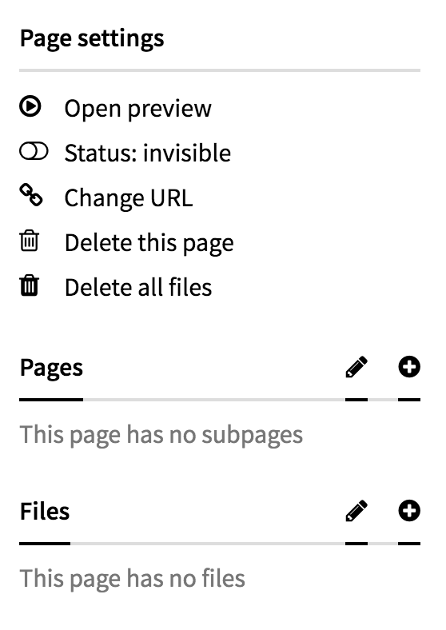

# Trash-files field

A custom [Kirby](http://getkirby.com) field which adds a "Delete all files" button in the sidebar of the panel page.



## Kirby installation
Put the content of this repo in `/site/fields/trashfiles/`.

<sup>_Please note that in order to put a custom action item in the panel's sidebar, I had to use a hacky injection method. Due to that, this field may not work on panel versions other than `2.3.2`._</sup>


## Options
```YAML
fields:
  trash:
    type: trashfiles
    text: 'Delete all the files of this page' # custom action text
```

## Contribute
Feel free to fork and pull request.

## License
[MIT](https://tldrlegal.com/license/mit-license).